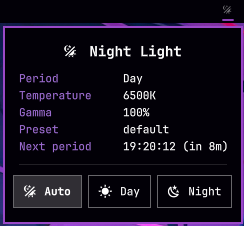

# omarchy-sunsetr

Night light for [Omarchy](https://omarchy.org) driven by [sunsetr](https://github.com/psi4j/sunsetr) instead of hyprsunset.

Omarchy's built-in night light (`omarchy.nightlight`) talks to hyprsunset only. If you run sunsetr, the stock bar icon never reflects reality and clicking it spawns hyprsunset on top of sunsetr. This plugin replaces the icon, keybind target and menu entry with ones that drive sunsetr presets.

<p align="center"></p>

## What you get

- Bar icon `󰔎`. Left click toggles, right click opens the panel above (Auto / Day / Night), middle click refreshes.
- Toggle logic: forced preset → back to auto; auto + on → force day; auto + off → force night.
- `sunsetr-nightlight` CLI for keybindings and scripts.
- Menu Trigger ▸ Toggle ▸ Nightlight repointed at sunsetr, ✓ when on.
- Starts sunsetr if it isn't running.

## Requirements

- Omarchy (Quattro shell, Hyprland). Uses `jq`, which Omarchy ships.
- [`sunsetr`](https://github.com/psi4j/sunsetr) installed, configured (`sunsetr geo`), and autostarted, e.g. in `~/.config/hypr/autostart.lua`:
  ```lua
  o.launch_on_start("sunsetr")
  ```
  Do not autostart hyprsunset.

## Install

```bash
omarchy plugin add https://github.com/Varantha/omarchy-sunsetr.git
~/.config/omarchy/plugins/varantha.sunsetr/bin/setup
```

(or `git clone` the repo to `~/.config/omarchy/plugins/varantha.sunsetr` and run `bin/setup` from there.)

The bar icon works as soon as the plugin is enabled. `bin/setup` (idempotent, asks before changing anything, `--yes` to skip) does the rest:

1. create `~/.config/sunsetr/presets/{day,night}/sunsetr.toml` if missing (static mode, values from your `sunsetr.toml`; the plugin also does this on first use)
2. link `sunsetr-nightlight` into `~/.local/bin`
3. remove `NightLight` from `omarchy.indicators` in `~/.config/omarchy/shell.json`
4. override `trigger.toggle.nightlight` in `~/.config/omarchy/extensions/omarchy-menu.jsonc`
5. `omarchy plugin enable varantha.sunsetr --before omarchy.indicators` if not already enabled

Edited files get a `.bak.sunsetr.<timestamp>` copy next to them.

Then rebind the key yourself in `~/.config/hypr/bindings.lua`:

```lua
hl.unbind("SUPER + CTRL + N")
o.bind("SUPER + CTRL + N", "Toggle nightlight", "sunsetr-nightlight toggle")
```

If the icon doesn't show up, `omarchy restart shell`.

The stock `omarchy.nightlight` service is left enabled but dormant. Nothing in the bar or menu reaches it any more; `omarchy toggle nightlight` still does — avoid it.

## Configure

Widget entry in `shell.json` (`bar.layout.center`):

```json
{ "id": "varantha.sunsetr", "interval": 30, "dayPreset": "day", "nightPreset": "night", "reveal": "hover" }
```

| key | default | meaning |
|---|---|---|
| `interval` | `30` | seconds between `sunsetr status` polls |
| `dayPreset` | `"day"` | sunsetr preset used to force off |
| `nightPreset` | `"night"` | sunsetr preset used to force on |
| `reveal` | `"hover"` | icon while off: `hover` (peek with the centre section, like stock indicators), `always` (dimmed), `never` |

**Presets.** `default` is sunsetr's built-in "no preset" state — nothing to create. `day` and `night` are just names: bring your own preset files, or point `dayPreset`/`nightPreset` at ones you already have. Existing preset files are never overwritten. "On" means the current temperature is below 6000 K (same threshold as stock), whatever the preset contains.

## Use

```
sunsetr-nightlight toggle|on|off|auto|status|start|stop|refresh
omarchy-shell sunsetr status|toggle|enable|disable|auto|preset <name>|start|stop|refresh
```

The CLI goes through the shell when it is running and falls back to `sunsetr` directly otherwise. Set `SUNSETR_DAY_PRESET` / `SUNSETR_NIGHT_PRESET` for the fallback path if you renamed the presets.

## Uninstall

```bash
~/.config/omarchy/plugins/varantha.sunsetr/bin/setup --uninstall
omarchy plugin remove varantha.sunsetr
```

Restores `omarchy.indicators`, removes the menu override and CLI link, deletes presets it created (if unmodified), returns sunsetr to `default`. Keybindings are yours to revert.

## Notes

- sunsetr's `--background` uses the pre-0.56 `hyprctl dispatch exec` syntax and fails on current Hyprland; the plugin starts sunsetr with `uwsm-app` instead.
- While a forced preset is active, sunsetr's schedule is paused until you go back to Auto — that's sunsetr's preset semantics.
- Developing: after editing QML, `omarchy restart shell` (hot reload leaves the old instances running). `node tests/model.test.js` covers the parser/decision logic. `omarchy-shell varantha.sunsetr debug` dumps widget state.

## License

MIT
